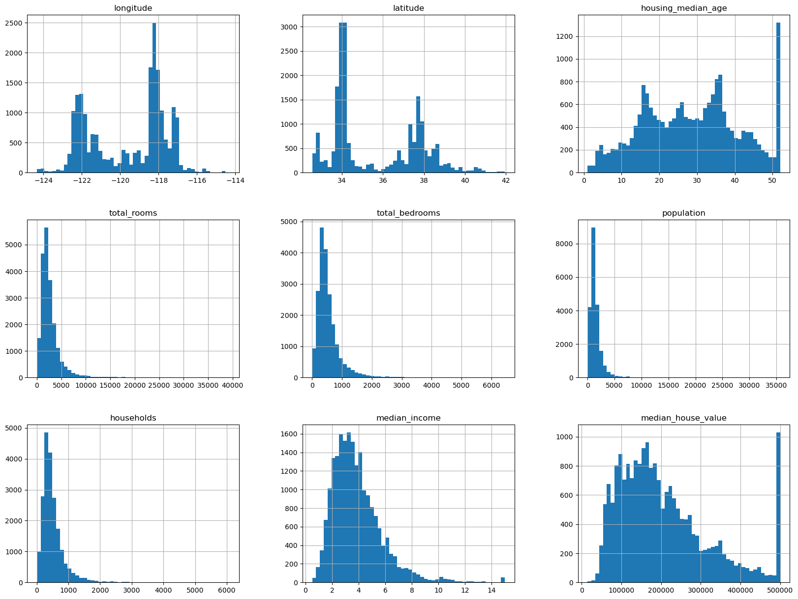

# Housing Price Prediction Project

This project focuses on building a machine learning model to predict median housing prices in California districts in America. It encompasses the entire ML pipeline from data acquisition to model evaluation.

## Table of Contents
- [Project Overview](#project-overview)
- [Installation](#installation)
- [Dataset](#dataset)
- [Workflow](#workflow)
  - [Data Fetching & Exploration](#1-data-fetching--exploration)
  - [Stratified Train-Test Split](#2-stratified-train-test-split)
  - [Data Preprocessing](#3-data-preprocessing)
  - [Model Training & Evaluation](#4-model-training--evaluation)
  - [Hyperparameter Tuning](#5-hyperparameter-tuning)
  - [Final Evaluation](#6-final-evaluation)
- [Future Improvements](#future-improvements)

## Project Overview
**Objective**: Predict median house values using California census data  
**Key Features**:
- 10 numerical features (median income, housing median age, etc.)
- 1 categorical feature (ocean proximity)  
**Models Used**: Linear Regression, Decision Trees, Random Forest, SVM  
**Best Model**: Random Forest (RMSE: $48,209???)

## Installation
1. Clone repository:
   ```bash
   git clone https://github.com/yourusername/housing-price-prediction.git
   cd housing-price-prediction
2. Install dependencies
   ```base
   pip install -r requirements.txt
## Dataset
The dataset is sourced from a publicly available repository:
* [Click here to download the dataset](https://raw.githubusercontent.com/dangtna1/datasets/refs/heads/main/housing.tgz)
* Description: Contains housing data for California districts, including features like longitude, latitude, median income, and ocean proximity.
* Size: 20,640 rows and 10 columns.
* Features:
    * longitude/latitude coordinates
    * housing_median_age
    * total_rooms
    * total_bedrooms
    * population
    * households
    * median_income
    * median_house_value
    * ocean_proximity (categorical)
## Workflow
### 1. Data Fetching & Exploration
**Automated Data Pipeline:**
   ```python
def fetch_housing_data():
    """Auto-download and extract dataset"""
    # Handles HTTP fetch and tar extraction
    
def load_housing_data():
    """Returns cleaned DataFrame"""
    return pd.read_csv(os.path.join(HOUSING_PATH, "housing.csv"))
```

**Key Insights:**
* 207 districts missing `total_bedrooms`
* `ocean_proximity` distribution
   * <1H OCEAN: 9136
   * INLAND: 6551
   * NEAR OCEAN: 2658
   * NEAR BAY: 2290
   * ISLAND: 5
* The distribution of each variable

### 2. Stratified Train-Test Split
 ```python
# Create income strata
housing["income_cat"] = pd.cut(housing["median_income"],
                              bins=[0, 1.5, 3, 4.5, 6, np.inf],
                              labels=[1, 2, 3, 4, 5])

# Stratified split
split = StratifiedShuffleSplit(n_splits=1, test_size=0.2, random_state=42)
for train_index, test_index in split.split(housing, housing["income_cat"]):
    strat_train_set = housing.loc[train_index]
    strat_test_set = housing.loc[test_index]
```

**Stratification Results:**
| income_cat | overall_proportion     | strat_proportion       | random_proportion      |
|------------|-----------------------|------------------------|------------------------|
| 1          | 0.039825581395348836  | 0.03997093023255814    | 0.04433139534883721    |
| 2          | 0.3188468992248062    | 0.3187984496124031     | 0.31443798449612403    |
| 3          | 0.3505813953488372    | 0.3505329457364341     | 0.3483527131782946     |
| 4          | 0.17630813953488372   | 0.17635658914728683    | 0.18023255813953487    |
| 5          | 0.11443798449612404   | 0.11434108527131782    | 0.11264534883720931    |

When we compare the distribution of income categories among data in *overall data*, *stratified sampled data*, and *random sampled data*. We can see that the distribution of income categories with *stratified* methods is closely the same as the distribution in *overall data*. This method can prevent bias when we sample which is likely to help build a good model
### 3. Data Preprocessing
**Pipeline Architecture:**
```
graph TD
    A[Raw Data] --> B[ColumnTransformer]
    B -->|Numerical| C[Impute Missing]
    C --> D[Add Features]
    D --> E[Scale]
    B -->|Categorical| F[OneHotEncode]
    E --> G[Combined Features]
    F --> G
    G --> H[Ready for Model]
```
### 4. Model Training & Evaluation
**Models Compared:**
```python
models = {
    "Linear Regression": LinearRegression(),
    "Decision Tree": DecisionTreeRegressor(),
    "Random Forest": RandomForestRegressor(),
    "SVM": SVR(kernel='linear')
}
```
**Cross-Validation Results:**
| Model | Mean RMSE     | Std Dev       |
|-----------|--------------|------------|
| Linear Regression          | 69104.07998247063  | 2880.3282098180666    |
| Decision Tree          | 70881.49564861869    | 2783.9086144558687     |
| Random Forest          | 50561.786847478754    | 778.4388445250213     |
| SVM	          | 72604.3433401591   | 1289.3324949001326    |

**Key Findings:**
* Random Forest showed best initial performance (50k RMSE)
* Decision Trees severely overfit (training RMSE: 0 if we don't use cross-validation), so it's better to use cross-validation to measure performance of a model before launching
* Linear models underperformed due to non-linear relationships
### 5. Hyperparameter Tuning
**Grid Search Configuration:**
```python
param_grid = [
    {'n_estimators': [3, 10, 30], 'max_features': [2, 4, 6, 8]},
    {'bootstrap': [False], 'n_estimators': [3, 10], 'max_features': [2, 3, 4]}
]

grid_search = GridSearchCV(forest_reg, param_grid, cv=5, scoring='neg_mean_squared_error') # (3*4 + 2*3)*5 = 90 times
grid_search.fit(housing_prepared, housing_labels)
```
**Randomized Search:**
```python
params_distribs = {
    'n_estimators': stats.randint(low=1, high=200),
    'max_features': stats.randint(low = 1, high = 8)
}
rnd_search = RandomizedSearchCV(
    forest_reg,
    param_distributions=params_distribs,
    n_iter=10,
    cv=5,
    scoring='neg_mean_squared_error',
    random_state=42
) # trained and evaluated 10*5 times

rnd_search.fit(housing_prepared, housing_labels)
```
**Feature Importance:**
* Median Income
* Inland Location
* Population/Household
* Housing Median Age
* Longitude
### 6. Final Evaluation
**Test Set Performance:**
```python
final_rmse = 47776.551456877714
confidence_interval = (45791.78428923, 49682.09164107)  # 95% confidence
```
**Production Readiness:**
* Serialized best model with joblib
* Full pipeline handles missing data and feature scaling
* Model accepts raw data and outputs predictions
## Future Improvements
### 1. Feature Engineering:
* Incorporate real-time economic indicators
* Add walkability scores from external APIs
### 2. Model Enhancements:
* Experiment with Gradient Boosted Trees (XGBoost/LightGBM)
* Implement stacked ensemble models
### 3. Deployment and Monitor:
* Add data drift detection
* Implement MLflow for experiment tracking
